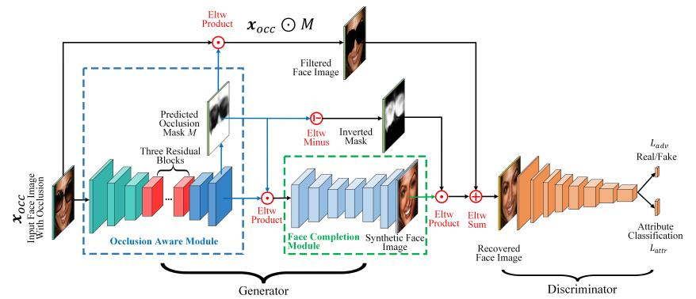
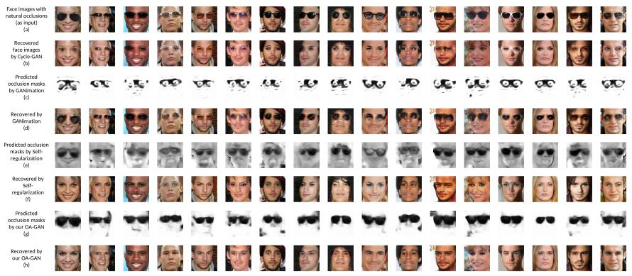

This is the source code for paper
"Semi-Supervised Natural Face De-Occlusion"



## Experiment result



## Environment requirest

This code is based on Pytorch 1.1 and CUDA 8.0.

## License

This project is released under the [Apache 2.0 license](LICENSE).


## Citation

If you find this work useful, please cite our papers with the following bibtex:


```
@ARTICLE{9195444,
  author={Cai, Jiancheng and Han, Hu and Cui, Jiyun and Chen, Jie and Liu, Li and Zhou, S. Kevin},
  journal={IEEE Transactions on Information Forensics and Security}, 
  title={Semi-Supervised Natural Face De-Occlusion}, 
  year={2021},
  volume={16},
  number={},
  pages={1044-1057},
  doi={10.1109/TIFS.2020.3023793}}

```
